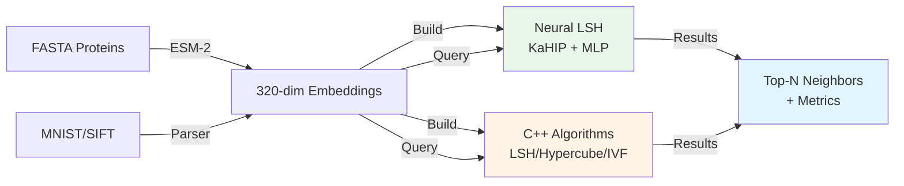

# Vector Similarity Search

[](https://opensource.org/licenses/MIT)
[](https://github.com/TsekrekosEA/vector-similarity-search/actions)
[](https://github.com/TsekrekosEA/vector-similarity-search/actions)
[](https://isocpp.org/)
[](https://www.python.org/)

High-performance Approximate Nearest Neighbor (ANN) search algorithms for large-scale vector similarity search. Includes implementations of LSH, Hypercube, IVF-Flat, IVF-PQ, and Neural LSH, with a complete protein similarity search application.

> **About this Project:** This is a graduate project from the National and Kapodistrian University of Athens (EKPA), Department of Informatics and Telecommunications, demonstrating advanced algorithm implementation, scientific computing, and bioinformatics applications.

## 🎯 Key Features

- **5 ANN Algorithms Implemented:** LSH, Hypercube, IVF-Flat, IVF-PQ, Neural LSH (learned partitioning)
- **Hybrid C++/Python Architecture:** Performance-critical code in C++, neural networks and orchestration in Python
- **Neural LSH:** Novel approach using graph partitioning (KaHIP) + deep learning for 4x speedup over BLAST
- **Protein Search Application:** Real-world bioinformatics use case with ESM-2 embeddings
- **Comprehensive Benchmarks:** Evaluated on MNIST, SIFT, and Swiss-Prot (573K proteins)
- **Production-Ready:** Battle-tested code with proper documentation and reproducible results

## 📊 Performance Highlights

**Protein Search (Swiss-Prot, 573K proteins)**

| Method | Speed (QPS) | Recall@50 | Build Time | Notes |
|--------|------------|-----------|------------|-------|
| **Neural LSH** | **9.5** ⚡ | **0.67** | 10 min | Best overall |
| BLAST (baseline) | 2.3 | 1.00 | - | Sequence alignment |
| Hypercube | 1.1 | 0.60 | <1 min | Fast build |
| IVF-Flat | 0.09 | 0.67 | 27 min | Highest accuracy |

*Neural LSH is 4x faster than BLAST while finding 67% of its results + novel remote homologs*


*Recall vs. Speedup on MNIST dataset - Neural LSH dominates the upper-right (fast + accurate)*

See [RESULTS.md](RESULTS.md) for complete benchmarks and analysis.

## 🚀 Quick Start

### Prerequisites

- **C++ compiler** (g++ or clang++) with C++17 support
- **Python 3.9+** (3.10+ recommended)
- **BLAST+** (for protein search baseline comparison)
- ~1GB disk space for data files

### Installation

```bash
# Clone the repository
git clone https://github.com/TsekrekosEA/vector-similarity-search.git
cd vector-similarity-search

# Option 1: Full protein search setup (downloads Swiss-Prot, generates embeddings)
cd test_framework-protein_folding
./setup.sh

# Option 2: Just build C++ components for MNIST/SIFT
cd algorithms/lsh-hypercube-ivf
make

# Option 3: Just setup Python neural LSH
cd algorithms/neural_lsh
pip install -r requirements.txt
```

### Run Protein Similarity Search

```bash
cd test_framework-protein_folding

# Full pipeline: embedding generation + all 6 methods
./run_pipeline.sh

# Quick test with specific method
./run_pipeline.sh --method neural --skip-embed
```

### Run MNIST/SIFT Benchmarks

```bash
cd algorithms/lsh-hypercube-ivf

# Build the search binary
make

# Run comprehensive benchmarks
make benchmark

# Or run specific dataset
make benchmark-mnist
make benchmark-sift
```

### Use Neural LSH

```bash
cd algorithms/neural_lsh

# Build index
python nlsh_build.py -d dataset.dat -i index.pth -type sift

# Search
python nlsh_search.py \
    -d dataset.dat \
    -q queries.dat \
    -i index.pth \
    -o results.txt \
    -type sift \
    -N 50 \
    -T 10
```

## 🏗️ Architecture



**Three-Layer Design:**
1. **C++ Core** (`algorithms/lsh-hypercube-ivf/`) - Traditional ANN methods with cache-optimized data structures
2. **Neural LSH** (`algorithms/neural_lsh/`) - Learned partitioning using graph theory + deep learning
3. **Protein Application** (`test_framework-protein_folding/`) - End-to-end bioinformatics pipeline

See [docs/ARCHITECTURE.md](docs/ARCHITECTURE.md) for detailed system design.

## 📁 Project Structure

```
├── algorithms/
│   ├── lsh-hypercube-ivf/      # C++ implementations
│   │   ├── src/                # Source files
│   │   ├── include/            # Headers
│   │   └── Makefile            # Build system
│   └── neural_lsh/             # Python Neural LSH
│       ├── nlsh_build.py       # Index building
│       └── nlsh_search.py      # Search queries
│
├── test_framework-protein_folding/  # Protein search application
│   ├── setup.sh                # Environment setup
│   ├── run_pipeline.sh         # Main orchestration
│   ├── protein_embed.py        # ESM-2 embedding generation
│   └── protein_search.py       # ANN comparison + BLAST
│
├── docs/                       # Documentation
│   ├── ARCHITECTURE.md         # System design
│   ├── Result_Analysis_Greek.pdf  # Full academic analysis
│   └── images/                 # Benchmark charts
│
├── scripts/                    # Utility scripts
│   └── plot_results.py         # Visualization
│
├── RESULTS.md                  # Benchmark findings (English summary)
├── CITATION.cff                # Citation information
└── README.md                   # This file
```

## 🔬 Algorithms Explained

### Neural LSH (Recommended)
**Approach:** Use graph partitioning (KaHIP) to create training labels, train MLP to predict partitions
- **Pros:** Best speed-accuracy trade-off, adapts to data distribution
- **Cons:** 10-minute build time, requires training
- **Best for:** Large-scale search with frequent queries

### LSH (Locality Sensitive Hashing)
**Approach:** Random projections with collision-based bucketing
- **Pros:** Fast build, simple, theoretical guarantees
- **Cons:** Requires parameter tuning for good accuracy
- **Best for:** Theoretical applications, quick prototyping

### Hypercube
**Approach:** Project to Hamming space, probe nearby vertices
- **Pros:** Instant build, low memory
- **Cons:** Lower accuracy than Neural LSH
- **Best for:** Rapid prototyping, moderate-scale problems

### IVF-Flat
**Approach:** k-means clustering + inverted file index
- **Pros:** Highest accuracy
- **Cons:** 27-minute build time, slow queries
- **Best for:** Static databases, infrequent queries

### IVF-PQ (Product Quantization)
**Approach:** IVF + vector quantization for compression
- **Pros:** Compressed index, good accuracy
- **Cons:** 63-minute build time
- **Best for:** Large databases with memory constraints

See [RESULTS.md](RESULTS.md) for detailed performance comparisons.

## 🧬 Protein Similarity Search

This project includes a complete protein similarity search pipeline:

**Input:** FASTA sequences (e.g., Swiss-Prot database)
**Embedding:** ESM-2 protein language model (320-dimensional)
**Search:** 5 ANN methods + BLAST baseline
**Output:** Comprehensive comparison with metrics

**Key Insight:** ESM-2 embeddings capture structural/functional similarity beyond sequence alignment, enabling detection of remote homologs that BLAST misses.

**Example Use Case:**
```bash
# Search for proteins similar to human EGFR
echo ">EGFR
MRPSGTAGAALLALLAALCPASRALEEKKVCQGTSNKLTQLGTFEDHFLSLQR..." > query.fasta

cd test_framework-protein_folding
python protein_search.py \
    -d data/protein_vectors.dat \
    -q query.fasta \
    -o results.txt \
    -method neural
```

## 📚 Documentation

- **[RESULTS.md](RESULTS.md)** - Benchmark results and performance analysis
- **[docs/ARCHITECTURE.md](docs/ARCHITECTURE.md)** - System architecture and design decisions
- **[algorithms/neural_lsh/README.md](algorithms/neural_lsh/README.md)** - Neural LSH implementation details
- **[test_framework-protein_folding/README.md](test_framework-protein_folding/README.md)** - Protein search guide
- **[.github/copilot-instructions.md](.github/copilot-instructions.md)** - AI assistant guidance for development

## 🛠️ Development

### Build C++ Components

```bash
cd algorithms/lsh-hypercube-ivf
make                    # Build search binary
make clean              # Remove build artifacts
make benchmark          # Run benchmarks
```

### Run Python Tests

```bash
cd algorithms/neural_lsh
python -m pytest        # If tests exist
flake8 .                # Lint Python code
```

### Code Style

- **C++:** Follow existing style (see `.clang-format` if present)
- **Python:** PEP 8 compliant, use type hints
- See [CONTRIBUTING.md](CONTRIBUTING.md) for detailed guidelines

## 📖 Citation

If you use this software in your research, please cite:

```bibtex
@software{Tsekrekos_Vector_Similarity_Search,
  author = {Tsekrekos, Egor-Andrianos},
  title = {Vector Similarity Search: High-Performance ANN Algorithms},
  year = {2025},
  url = {https://github.com/TsekrekosEA/vector-similarity-search},
  institution = {National and Kapodistrian University of Athens}
}
```

## 🙏 Acknowledgments

**Institution:** National and Kapodistrian University of Athens (EKPA), Department of Informatics and Telecommunications

**Datasets:**
- MNIST (Yann LeCun et al.)
- SIFT (David Lowe)
- Swiss-Prot (UniProt Consortium)

**Libraries:**
- [PyTorch](https://pytorch.org/) - Neural network framework
- [KaHIP](https://github.com/KaHIP/KaHIP) - Graph partitioning
- [transformers](https://huggingface.co/transformers/) - ESM-2 model
- [BioPython](https://biopython.org/) - Bioinformatics tools
- [scikit-learn](https://scikit-learn.org/) - Machine learning utilities

## 📄 License

This project is licensed under the MIT License - see the [LICENSE](LICENSE) file for details.

## 🤝 Contributing

Contributions are welcome! Please see [CONTRIBUTING.md](CONTRIBUTING.md) for guidelines.

**Areas for contribution:**
- Additional ANN algorithms (HNSW, NGT, etc.)
- GPU acceleration (CUDA implementations)
- Additional benchmarks and datasets
- Documentation improvements

## 📧 Contact

**Egor-Andrianos Tsekrekos**
- GitHub: [@TsekrekosEA](https://github.com/TsekrekosEA)
- Email: egor.andrianos.tsekrekos@gmail.com

---

**⭐ If you find this project useful, please consider giving it a star!**
