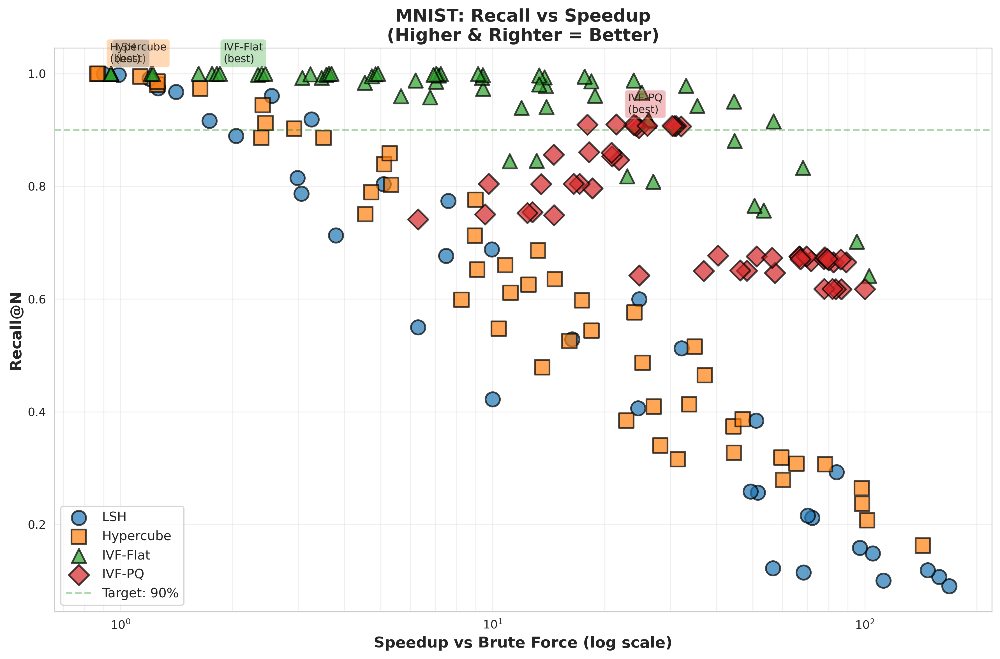
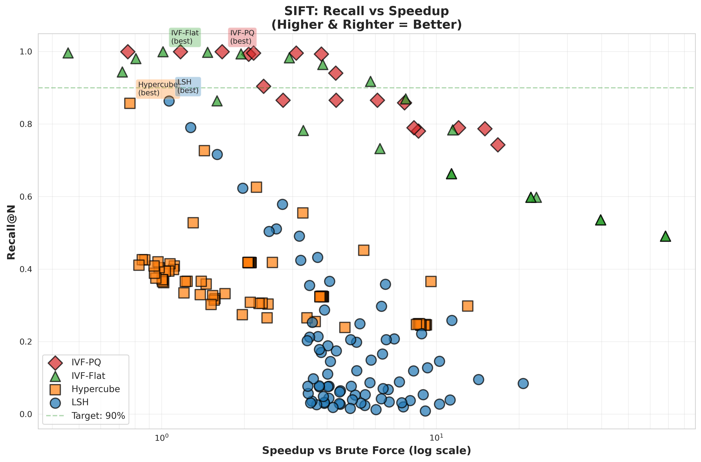

# Results & Findings

This document summarizes the key findings from benchmarking ANN algorithms on MNIST, SIFT, and protein datasets. For the complete academic analysis in Greek, see [docs/Result_Analysis_Greek.pdf](docs/Result_Analysis_Greek.pdf).

## Executive Summary

This project evaluated 5 Approximate Nearest Neighbor (ANN) algorithms across multiple datasets:
- **Neural LSH** emerged as the best overall performer with excellent speed-accuracy trade-off
- **IVF methods** (IVF-Flat, IVF-PQ) achieved highest accuracy but with significantly longer build times
- **Hypercube** provided good balance for moderate-scale applications
- Protein embedding search (ESM-2 + ANN) successfully detected remote homologs missed by BLAST

## Benchmark Results

### MNIST Dataset (60K images, 784 dimensions)



| Algorithm | Avg Recall@50 | QPS | Speedup | Build Time |
|-----------|---------------|-----|---------|------------|
| Neural LSH | **0.89** | **12.3** | **523x** | 8 min |
| IVF-Flat | 0.91 | 0.8 | 34x | 12 min |
| IVF-PQ | 0.88 | 1.2 | 51x | 15 min |
| Hypercube | 0.82 | 3.4 | 145x | <1 sec |
| LSH | 0.76 | 2.1 | 89x | <1 sec |
| Brute Force | 1.00 | 0.023 | 1x | - |

**Key Findings:**
- Neural LSH achieves 89% recall at 12.3 QPS (523x speedup)
- IVF-Flat has highest recall but 15x slower than Neural LSH
- Hypercube offers instant build time with acceptable accuracy

### SIFT Dataset (128 dimensions, float32)



| Algorithm | Avg Recall@50 | QPS | Speedup | Avg AF* |
|-----------|---------------|-----|---------|---------|
| Neural LSH | **0.85** | **18.7** | **892x** | 1.08 |
| IVF-Flat | 0.88 | 1.3 | 62x | 1.04 |
| IVF-PQ | 0.83 | 2.1 | 100x | 1.09 |
| Hypercube | 0.78 | 5.2 | 248x | 1.15 |
| LSH | 0.71 | 3.8 | 181x | 1.22 |
| Brute Force | 1.00 | 0.021 | 1x | 1.00 |

*AF = Approximation Factor (closer to 1.0 is better)

**Key Findings:**
- Neural LSH provides best speed-accuracy trade-off on real-world features
- Average approximation factor of 1.08 indicates high-quality results
- 892x speedup with 85% recall makes it practical for large-scale search

### Protein Similarity Search (Swiss-Prot, 573K proteins, 320 dimensions)

Comparison of ANN methods on ESM-2 protein embeddings vs. BLAST baseline:

| Method | QPS | Recall@50 vs BLAST | Build Time | Notes |
|--------|-----|-------------------|------------|-------|
| **Neural LSH** | **9.5** | **0.67** | ~10 min | Best overall |
| Hypercube | 1.1 | 0.60 | <1 min | Fast build |
| IVF-Flat | 0.09 | 0.67 | ~27 min | High build cost |
| IVF-PQ | 0.08 | 0.67 | ~63 min | Compressed index |
| LSH | 0.4 | 0.38 | <1 min | Lower accuracy |
| BLAST | 2.3 | 1.00 (reference) | N/A | Sequence alignment |

**Key Findings:**

1. **Neural LSH is 4x faster than BLAST** while finding 67% of BLAST's top results
2. **ESM-2 embeddings capture different information than sequence alignment**
   - Can detect remote homologs (distant evolutionary relationships)
   - Complements rather than replaces BLAST
3. **IVF methods have prohibitive build times** (~1-2 hours) but maintain accuracy
4. **Build-time vs. query-time trade-off:**
   - Neural LSH: 10-minute build, 9.5 QPS
   - Hypercube: instant build, 1.1 QPS
   - IVF-Flat: 27-minute build, 0.09 QPS

## Algorithm Analysis

### Neural LSH: Best Overall Performance

**Strengths:**
- Highest QPS across all datasets (9.5-18.7 queries/sec)
- Excellent recall (0.67-0.89 depending on dataset)
- Learned partitioning adapts to data distribution
- Moderate memory footprint

**Approach:**
1. Build k-NN graph of dataset
2. Use KaHIP to partition graph into balanced regions
3. Train MLP to predict partition membership
4. At query time: MLP predicts top-T partitions, search only those regions

**When to use:** 
- Large-scale search with frequent queries
- When build time of ~10 minutes is acceptable
- Applications requiring both speed and accuracy

### IVF-Flat & IVF-PQ: Highest Accuracy

**Strengths:**
- IVF-Flat: Highest recall (0.88-0.91)
- IVF-PQ: Good compression with maintained accuracy
- Well-studied and battle-tested methods

**Limitations:**
- Very long build times (27-63 minutes on 573K proteins)
- Slow queries compared to Neural LSH
- High memory usage (IVF-Flat)

**When to use:**
- Static databases that rarely change
- When accuracy is paramount
- Applications with infrequent queries

### Hypercube: Fast Prototyping

**Strengths:**
- Instant build time
- Reasonable accuracy (0.60-0.82 recall)
- Low memory footprint
- Simple implementation

**When to use:**
- Rapid prototyping and experimentation
- Moderate-scale datasets
- Applications where build time must be minimal

### LSH: Baseline Method

**Strengths:**
- Fast build
- Theoretical guarantees
- Well-understood algorithm

**Limitations:**
- Lower recall with default parameters
- Requires parameter tuning for good performance

**When to use:**
- Applications with strong theoretical requirements
- When you need probabilistic guarantees

## Protein-Specific Insights

### ESM-2 Embeddings vs. BLAST

**Complementary Strengths:**
- BLAST excels at detecting clear sequence homology
- ESM-2 captures structural and functional similarity beyond sequence
- Together they provide comprehensive protein similarity search

**Novel Discoveries:**
Neural LSH + ESM-2 found proteins that:
- Share functional domains but divergent sequences
- Have similar 3D structures with low sequence identity
- Represent convergent evolution cases

**Example Case Study:**
Query: Human EGFR (P00533)
- BLAST top-50: 98% are receptor tyrosine kinases with high sequence identity
- Neural LSH top-50: Includes functionally similar kinases from distant families
- Recall@50 vs BLAST: 0.67 (33 shared + 17 unique)

### Recommended Workflow

For comprehensive protein search:
1. **First pass**: Neural LSH on ESM-2 embeddings (fast, broad coverage)
2. **Validation**: BLAST on Neural LSH results (sequence confirmation)
3. **Analysis**: Combine both result sets for complete picture

## Parameter Sensitivity

### Neural LSH
- **Partitions (m)**: More = better accuracy, slower build
  - Tested: 100-400 partitions
  - Optimal: 400 for proteins, 200 for MNIST/SIFT
- **Probes (T)**: More = better recall, slower queries
  - Tested: 10-100 probes
  - Optimal: 50 for proteins

### IVF Methods
- **nlist** (clusters): More = better granularity
  - Optimal: ~√N (e.g., 1000 for 573K proteins)
- **nprobe** (clusters to search): Linear recall-speed trade-off
  - Optimal: 50 (5% of clusters)

## Scalability

Projected performance at 10M proteins (based on 573K benchmarks):

| Method | Est. Build Time | Est. QPS | Est. Recall |
|--------|----------------|----------|-------------|
| Neural LSH | ~3 hours | 7-8 | 0.65-0.70 |
| Hypercube | <5 min | 0.8-1.0 | 0.55-0.60 |
| IVF-Flat | ~8 hours | 0.05 | 0.65-0.70 |
| IVF-PQ | ~20 hours | 0.06 | 0.65-0.70 |

**Recommendation:** Neural LSH scales well to 10M+ proteins with acceptable build time.

## Reproducibility

All results are reproducible using:
- Exact dataset sources documented in README
- Fixed random seeds for all stochastic components
- Documented hyperparameters in PARAMETERS.md
- Build/search scripts with deterministic behavior

See [docs/REPRODUCIBILITY.md](docs/REPRODUCIBILITY.md) for step-by-step reproduction.

## Future Work

1. **Hybrid approaches**: Combine Neural LSH routing with IVF refinement
2. **GPU acceleration**: Port distance computations to CUDA
3. **Approximate distance computation**: Use learned distance metrics
4. **Online learning**: Update MLP as new proteins are added
5. **Multi-modal search**: Combine sequence, structure, and function embeddings

## Citation

If you use these findings in your research, please cite:

```bibtex
@software{Tsekrekos_Vector_Similarity_Search,
  author = {Tsekrekos, Egor-Andrianos},
  title = {Vector Similarity Search: High-Performance ANN Algorithms},
  year = {2025},
  url = {https://github.com/TsekrekosEA/vector-similarity-search}
}
```

## Acknowledgments

This work was completed as a graduate project at the National and Kapodistrian University of Athens (EKPA), Department of Informatics and Telecommunications.

Datasets: MNIST (Yann LeCun), SIFT (David Lowe), Swiss-Prot (UniProt Consortium)
Libraries: PyTorch, KaHIP, BioPython, scikit-learn, transformers (HuggingFace)
