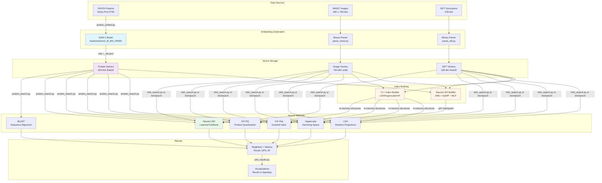

# Architecture

## System Overview



## Component Details

### 1. Data Sources & Embedding Generation

**Protein Data**
- Input: FASTA sequences from Swiss-Prot (~573K proteins)
- Embedding: ESM-2 protein language model (320-dimensional)
- Output: Binary .dat files + JSON ID mappings

**MNIST Data**
- Input: Handwritten digit images (28x28 pixels)
- Format: 784-dimensional uint8 vectors
- Preprocessing: Flatten to vector, no normalization

**SIFT Data**
- Input: SIFT descriptors from images
- Format: 128-dimensional float32 vectors
- Standard computer vision features

### 2. Index Building

**Neural LSH (Python)**
1. Build k-NN graph using scikit-learn
2. Partition graph with KaHIP (balanced graph partitioning)
3. Train PyTorch MLP to predict partitions
4. Save checkpoint: model weights + inverted index

**C++ Algorithms**
- Build in-memory structures during initialization
- LSH: Random projection hash tables
- Hypercube: Hamming space projections
- IVF: k-means clustering + inverted files
- IVF-PQ: k-means + product quantization codebooks

### 3. Search Phase

**Query Processing**
1. Load query vectors
2. For Neural LSH: MLP predicts top-T partitions, probe candidates
3. For C++ methods: Use hash tables/clusters to narrow search space
4. Compute exact distances for candidates
5. Return top-N nearest neighbors

**BLAST (Protein-specific)**
- Traditional sequence alignment algorithm
- Baseline comparison for protein search
- Uses sequence similarity, not embeddings

### 4. Evaluation

**Metrics**
- **Recall@N**: Fraction of true neighbors found
- **QPS**: Queries per second (throughput)
- **Approximation Factor**: Ratio of approximate to true distance
- **Speedup**: vs. brute-force exact search

**Visualization**
- Recall vs. Speedup plots
- Quality analysis charts
- Algorithm comparison tables

## Data Flow Example: Protein Search

```
1. Input: targets.fasta (query proteins)
   ↓
2. ESM-2 generates 320-dim embeddings
   ↓
3. For each algorithm:
   a. Neural LSH: MLP predicts partitions → search top-T
   b. LSH: Hash query → search matching buckets
   c. Hypercube: Project → probe nearby vertices
   d. IVF-*: Assign to clusters → search nprobe clusters
   e. BLAST: Sequence alignment
   ↓
4. Collect top-N neighbors + distances
   ↓
5. Compare all methods:
   - Recall vs BLAST top-N
   - Query time
   - Distance quality
   ↓
6. Generate report: output/results.txt
```

## Performance Characteristics

| Method | Build Time | Query Speed | Accuracy | Memory |
|--------|-----------|-------------|----------|---------|
| **Neural LSH** | ~10 min | **Fastest** (9.5 QPS) | High (0.67 recall) | Medium |
| **Hypercube** | Instant | Fast (1.1 QPS) | Medium (0.60 recall) | Low |
| **IVF-Flat** | ~27 min | Slow (0.1 QPS) | High (0.67 recall) | High |
| **IVF-PQ** | ~63 min | Slow (0.1 QPS) | High (0.67 recall) | Medium |
| **LSH** | Instant | Medium (0.4 QPS) | Lower (0.38 recall) | Medium |
| **BLAST** | N/A | Medium (2.3 QPS) | Reference (1.0) | N/A |

*Benchmarked on Swiss-Prot 573K proteins, 50 nearest neighbors*

## Technology Stack

**Languages & Frameworks**
- C++17 (core algorithms, performance-critical code)
- Python 3.9+ (neural networks, embeddings, orchestration)
- PyTorch (neural network training)

**Key Libraries**
- **KaHIP**: Graph partitioning for Neural LSH
- **scikit-learn**: k-NN graph construction
- **transformers**: ESM-2 protein language model
- **BioPython**: FASTA parsing, BLAST integration

**Build System**
- Make (C++ components)
- pip (Python dependencies)
- Shell scripts (orchestration)
